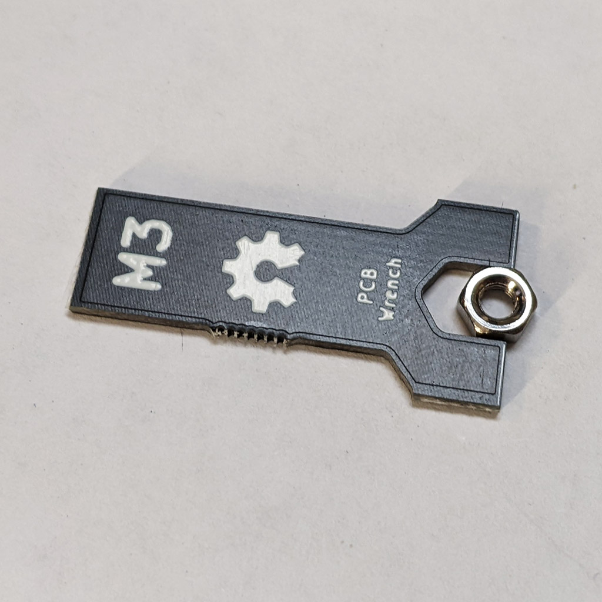
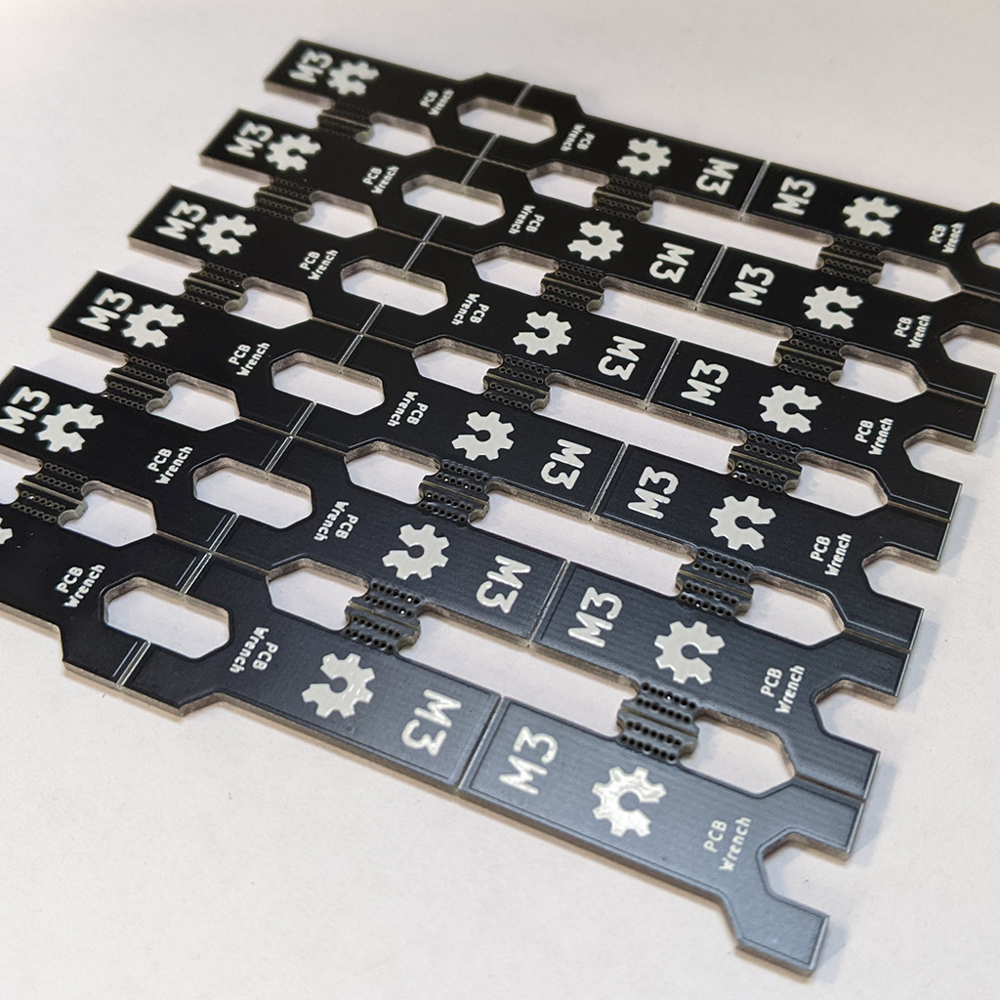
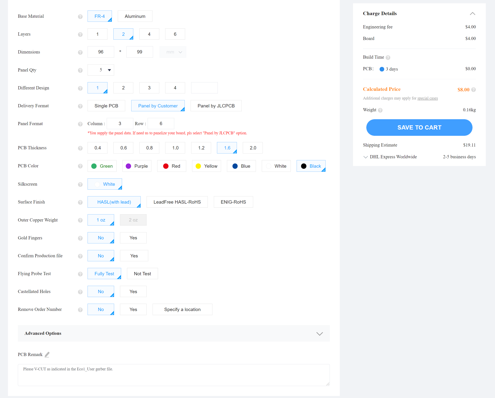
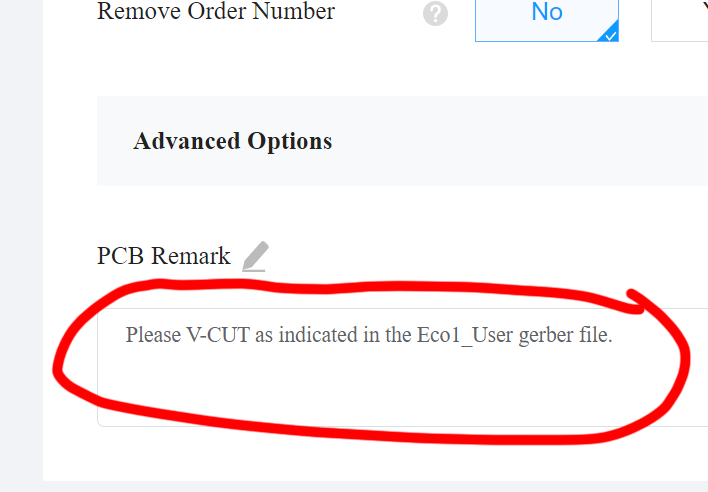
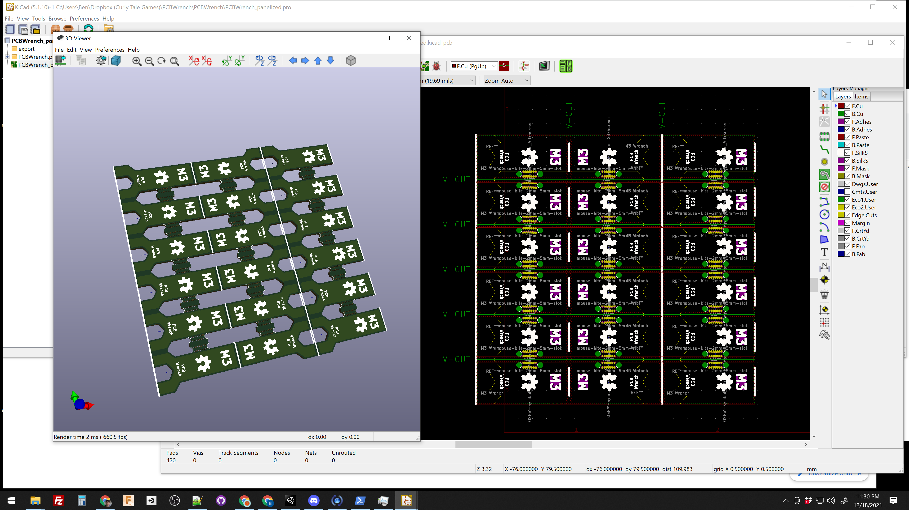

# PCB Wrench

## About

PCB Wrench is an open hardware project for electronics kit makers. It was designed to create lots of small M3 wrenches at an affordable price **($0.09 USD per wrench)**. The wrenches are strong and can tighten M3 nuts with a surprising amount of torque.

## Ordering

I used JLCPCB to produce my PCBs but PCB Way or any other fab should work

- Go to https://jlcpcb.com/

- Click the **Order Now** button

- Upload the **gerbers.zip** file

- Set the order options to the following settings:

  

### ** :rotating_light::rotating_light::rotating_light: - WAIT!!!! Add this comment to PCB Remarks - :rotating_light::rotating_light::rotating_light:**

    Please V-CUT as indicated in the Eco1_User gerber file.

Even if you specificy the PCB to be panelized sometimes technicians will ignore the V-grooving (V-CUT) gerber file so it's important to add that comment. 

[JLCPCB wants all of the milling opperations in the Edge_Cuts gerber file/layer in KiCad (#7 on that page)](https://support.jlcpcb.com/article/68-instructions-for-ordering), but if you do that KiCad will give you an error if you try to use the 3D previewer.

